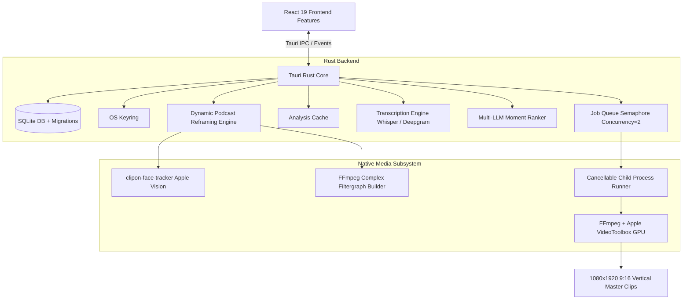

# ClipOn Architecture & System Design

## 1. System Overview

ClipOn is a desktop-native application engineered for high-performance video analysis, automated short-form clipping, and multi-person dynamic reframing.

The architecture combines:
- **Presentation Layer**: React 19 + TypeScript on Vite, embedded in Tauri v2 WebView.
- **Application Core**: Rust backend coordinating database persistence, API clients, job queueing, and media pipeline orchestration.
- **Media Engine**: FFmpeg with Apple Silicon VideoToolbox (`h264_videotoolbox`) hardware acceleration.
- **Computer Vision Engine**: Swift Vision framework tracker (`clipon-face-tracker`) for multi-person face detection and persistent identity tracking.
- **Storage Layer**: SQLite with versioned transactional migrations, foreign keys, and OS Keyring credential storage.

---

## 2. Component Architecture Diagram

---

## 3. Frontend Architecture

The frontend is strictly structured into modular feature domains under `src/features/`:

| Feature Module | Responsibility | Key Components |
|---|---|---|
| `error/` | Centralized application error store & recovery | `ErrorProvider`, `useAppError` |
| `projects/` | Workspace layout, navigation, project lifecycle | `ProjectSidebar`, `ProjectHeader`, `ProjectsDashboard` |
| `transcription/` | Interactive transcript search & inspection | `TranscriptionPanel` |
| `moments/` | AI candidate moments review, filtering & batch actions | `MomentsPanel`, `MomentCard` |
| `rendering/` | Subtitle style selection & render options | `CaptionStyleModal`, `RenderControls` |
| `jobs/` | Real-time render progress bar & job cancellation | `JobProgressBar` |
| `export/` | Preset platform aspect ratio & bitrate selection | `ExportPresetSelector` |
| `podcast/` | Multi-person timeline visualizer | `PodcastTimelinePreview` |
| `youtube/` | YouTube downloader with copyright terms verification | `YoutubeImportModal` |
| `social/` | AI titles/hashtags generation & Instagram Reels direct publish | `SocialKitModal`, `InstagramPublishModal` |
| `settings/` | Studio configuration (AI keys, storage, video modifiers) | `SettingsModal` |
| `system/` | Diagnostics & hardware acceleration monitoring | `StatusBar` |

---

## 4. Media Processing & Dynamic Reframing Pipeline

### Dynamic Podcast Reframing (16:9 → 9:16)
1. **Face & Identity Tracking**:
   - `clipon-face-tracker` runs Apple Vision face landmark requests at 5 fps over the clip interval.
   - Computes normalized bounding boxes and appearance prototypes.
   - Assigns persistent Person IDs using distance and appearance matching, keeping identities stable during occlusions.

2. **Layout Confirmation State Machine**:
   - Analyzes detected track counts over sliding temporal windows.
   - Generates contiguous `LayoutSegment` records (`single`, `split_two`, `split_three`).
   - Ensures no segment is shorter than 2.0s, eliminating jarring rapid transitions.
   - Applies hysteresis to confirm layout changes only after sustained face detections.

3. **Segment Filtergraph Synthesis**:
   - Single layout segment: Direct single-pass FFmpeg command.
   - Multi-segment timeline: Renders segment sub-clips into RAII-managed temporary directories (`TempDirGuard`) and concatenates with stream-level precision.
   - Seamless ASS subtitle overlay positioned along the dividing seam line.

---

## 5. Security & Credential Storage

Sensitive credentials (API keys for Deepgram, Gemini, Anthropic, DeepSeek, OpenAI, Groq, Meta Graph tokens) are stored via OS Keyring:
- **macOS**: Apple Keychain Services.
- **Linux**: Secret Service (Freedesktop).
- **Windows**: Windows Credential Manager.

Credentials are never stored in SQLite, committed to Git, or exposed through unencrypted logs.

---

## 6. Job Execution & Bounded Queue

- **Concurrency Limit**: Managed by `tokio::sync::Semaphore` with limit = 2.
- **Process Registration**: Child FFmpeg process IDs are registered in the global `JobManager`.
- **Cancellation**: Sending a cancellation event sends `SIGTERM` followed by `SIGKILL` to the child PID and immediately cleans up partial output files.
